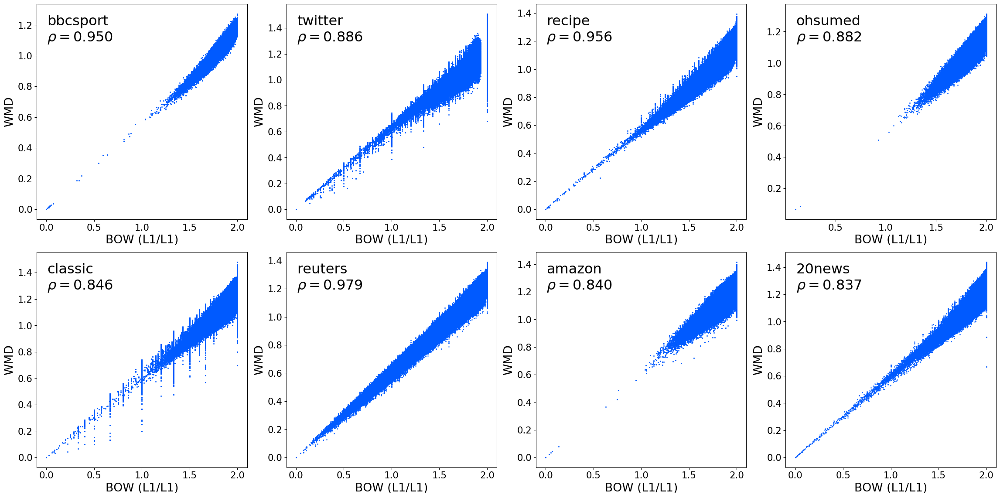
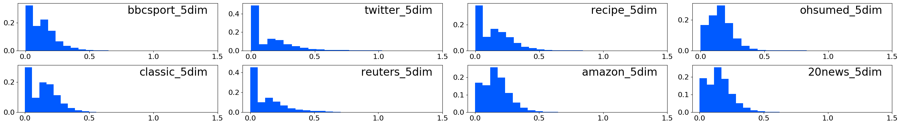

# Re-evaluating Word Mover's Distance (ICML 2022)

We re-evaluate the Word Mover's Distance and reveal the true performance of it.

Paper: https://arxiv.org/abs/2105.14403

↓ KNN classification errors in the original evaluation:


↓ kNN classification errors in our re-evaluation (after applying L1 normalization to BOW and TF-IDF):


## Requirements

* Python >= 3.7.3
* `numpy` >= 1.16.4
* `matplotlib` >= 3.1.1
* `scipy` >= 1.5.4
* `scikit-learn` >= 0.22.1
* `gensim` >= 3.8.3
* `POT` >= 0.7.0

Install them by `pip install -r requirements.txt`.

## Download datasets and distance matrices

Please be sure that `wget` and `unzip` are available in your machine for downloading the dataests. For example, `apt install wget zip unzip` in Ubuntu, or `brew install wget` in Mac will install them. Then,

```
$ bash ./download.sh
```

If it fails to download the distance matrices, please download the file from https://drive.google.com/uc?id=1svEiRgQWMDk-mO8NVMhJCrwvkpQy-l4f via a web browser and unzip it to the `distance/` directory. There should be, for example, `./distance/bbcsport-emd_tr_te_split.mat.npy` after this process.

`./dataset/*.mat` are the datasets. Please refer to https://github.com/mkusner/wmd for more details.

`./distance/*.npy` are the distance matrics. They can be loaded by the `np.load` function. The ij-th element stores the WMD distance between the i-th and j-th documents. See "Compute distances" to compute the matrix by yourself.

Note that there exists an empty document in the 20news dataset. The distance matrix has `-1` for the corresponding row and column. We included this document in the distance matrix because we want the shape to match the dataset size. Be sure to handle `-1` appropriately.

## Evaluation

Figure 3 and Tables 2 and 3 can be reproduced by `python evaluate.py`. Be sure to create or download the datasets and distance matrices beforehand.
Each line reports an error of a method for one-fold datasets and an error and std-dev for five-fold datasets.

```
$ python evaluate.py
bbcsport-emd_tr_te_split.mat
----------------------------
BOW (L1/L1)     3.9 ± 1.1
TF-IDF (L1/L1)  2.8 ± 1.1
BOW (L1/L2)     11.4 ± 3.6
TF-IDF (L1/L2)  25.5 ± 11.2
BOW (L2/L1)     15.2 ± 1.5
...
```

## Check duplications

`python duplication.py` checks duplications in the dataset. This script (1) reports the number of duplicated pairs and samples and (2) creates datasets without duplications. For the five-fold datasets, we maintain the original train/test splits, but it varys the size of training data among splits (though they are roughly the same). Therefore, `data['TR']` and `data['TE']` have different shapes with the original dataset. See `evaluate.py` for detailed usages.

## Results

Results for `python evaluate.py` (See Table 2 in the paper for more details).

|Method|bbcsport|twitter|recipe|ohsumed|classic|reuters|amazon|20news|rel.|
|----|----|----|----|----|----|----|----|----|----|
|BOW (L1/L1)|3.9 ± 1.1|30.0 ± 1.1|43.4 ± 0.8|44.1|4.1 ± 0.5|5.7|10.4 ± 0.5|29.1|1.000|
|TF-IDF (L1/L1)|2.8 ± 1.1|28.9 ± 0.8|40.1 ± 0.7|37.8|3.3 ± 0.4|5.5|8.0 ± 0.3|25.9|0.861|
|WMD|5.1 ± 1.2|29.6 ± 1.5|42.9 ± 0.8|44.5|2.9 ± 0.4|4.0|7.4 ± 0.5|26.8|0.917|
|WMD-TF-IDF|3.3 ± 0.9|28.3 ± 2.3|39.9 ± 1.1|39.7|2.7 ± 0.3|4.0|6.6 ± 0.2|24.1|0.804|
|BOW (NONE/L2)|19.4 ± 3.0|34.2 ± 0.6|60.0 ± 2.3|61.6|35.0 ± 0.9|11.8|28.2 ± 1.0|57.7|3.024|
|BOW (NONE/L1)|25.4 ± 1.5|32.7 ± 1.6|65.8 ± 2.5|69.3|52.1 ± 0.5|14.2|31.4 ± 1.2|73.9|3.931|
|TF-IDF (NONE/L2)|24.5 ± 1.3|38.2 ± 4.6|65.0 ± 1.9|65.3|38.8 ± 1.0|28.0|41.2 ± 3.2|60.0|3.867|
|TF-IDF (NONE/L1)|30.6 ± 1.3|37.8 ± 4.8|70.3 ± 1.3|70.6|52.6 ± 0.2|29.1|41.5 ± 4.9|74.6|4.602|
|BOW (L1/L2)|11.4 ± 3.6|37.0 ± 1.4|50.8 ± 1.1|56.7|17.3 ± 1.5|12.3|35.7 ± 1.3|46.5|2.253|
|BOW (L2/L1)|15.2 ± 1.5|33.3 ± 1.1|61.1 ± 1.1|65.7|51.1 ± 0.4|16.2|32.2 ± 1.3|77.6|3.622|
|BOW (L2/L2)|5.5 ± 0.7|31.0 ± 0.8|46.1 ± 0.6|46.2|6.3 ± 0.7|8.8|13.1 ± 0.5|33.2|1.254|
|TF-IDF (L1/L2)|25.5 ± 11.2|35.7 ± 1.4|54.2 ± 2.7|61.4|22.6 ± 4.2|24.7|41.9 ± 2.0|45.6|3.226|
|TF-IDF (L2/L1)|27.5 ± 7.2|33.4 ± 1.7|64.9 ± 3.8|69.7|52.0 ± 0.2|19.5|40.8 ± 6.6|78.3|4.245|
|TF-IDF (L2/L2)|4.0 ± 0.7|29.8 ± 1.5|43.7 ± 1.2|38.4|5.2 ± 0.3|10.5|11.1 ± 0.9|31.6|1.145|


Results for `python evaluate.py --clean` (See Table 3 in the paper for more details). Be sure to create clean data by `python duplication.py` before executing this.

|Method|bbcsport|twitter|recipe|ohsumed|classic|reuters|amazon|20news|rel.|
|----|----|----|----|----|----|----|----|----|----|
|BOW (L1/L1)|3.7 ± 1.0|30.6 ± 1.1|42.9 ± 0.6|39.7|4.2 ± 0.5|5.5|10.6 ± 0.6|29.2|1.000|
|TF-IDF (L1/L1)|2.3 ± 1.4|30.2 ± 0.7|40.0 ± 1.1|33.4|3.5 ± 0.2|5.9|8.0 ± 0.6|25.9|0.866|
|WMD|5.5 ± 1.2|30.6 ± 1.2|42.9 ± 0.9|40.6|3.4 ± 0.6|3.8|7.3 ± 0.4|26.9|0.952|
|WMD-TF-IDF|4.1 ± 1.5|28.8 ± 1.6|40.2 ± 0.9|35.7|2.8 ± 0.3|4.3|6.6 ± 0.3|24.2|0.848|
|BOW (NONE/L2)|22.8 ± 1.6|34.2 ± 0.6|59.1 ± 0.9|60.7|36.9 ± 1.1|11.7|28.9 ± 1.1|58.0|3.227|
|BOW (NONE/L1)|25.3 ± 2.1|33.9 ± 0.8|64.1 ± 0.8|67.4|55.0 ± 0.5|14.0|32.4 ± 1.3|73.5|4.044|
|TF-IDF (NONE/L2)|25.8 ± 1.1|33.5 ± 0.6|65.6 ± 1.0|62.8|41.1 ± 1.1|28.3|43.4 ± 5.4|59.8|4.032|
|TF-IDF (NONE/L1)|32.7 ± 1.2|33.6 ± 0.6|70.6 ± 1.8|69.5|55.6 ± 0.2|29.1|42.5 ± 4.8|74.7|4.804|
|BOW (L1/L2)|11.8 ± 0.7|40.2 ± 2.0|51.4 ± 1.4|55.8|17.5 ± 1.7|12.9|36.8 ± 1.4|46.7|2.336|
|BOW (L2/L1)|15.0 ± 1.6|34.3 ± 0.9|59.9 ± 0.7|64.3|54.0 ± 0.4|16.2|32.7 ± 2.1|77.1|3.715|
|BOW (L2/L2)|5.3 ± 0.9|32.6 ± 0.7|45.4 ± 1.1|43.2|6.7 ± 0.7|8.1|13.3 ± 0.5|33.2|1.263|
|TF-IDF (L1/L2)|20.0 ± 7.4|39.3 ± 1.4|54.1 ± 2.4|55.2|24.8 ± 3.0|24.5|43.2 ± 2.0|45.9|3.168|
|TF-IDF (L2/L1)|28.7 ± 5.8|33.5 ± 1.0|65.7 ± 2.8|65.7|55.0 ± 0.2|19.9|39.0 ± 5.4|78.6|4.390|
|TF-IDF (L2/L2)|3.1 ± 1.3|31.5 ± 1.5|43.6 ± 0.8|33.2|5.2 ± 0.4|10.6|11.1 ± 0.6|31.6|1.127|


## Create low dimensional data

`python create_lowdim.py` creates low dimensional data by the principal component analysis. It generates data in the `data/` directory. This process is necessary if you want to generate low dimensional plots, as we describe in the following sections.

## Scatter plots

Figures 4 and 7 can be reproduced by

```
$ python plot_scatter.py
```
Images are created in the `imgs/` directory. Be sure to create or download the datasets and distance matrices beforehand. See also "Create low dimensional data."

↓ Scatter plots of WMD vs L1/L1 BOW:



↓ Scatter plots of WMD vs L1/L1 BOW in 5-dimensional spaces:


## Hisotgrams

Figures 5 and 8 can be reproduced by

```
$ python plot_histogram.py
```
 
Images are created in the `imgs/` directory. Be sure to create or download the datasets and distance matrices beforehand. See also "Create low dimensional data."

↓ Histograms of distances between matched words:


↓ Histograms of distances between matched words in 5-dimensional spaces:



## Compute distances

`compute_distances.py` and `summarize_distances.py` are scripts for computing WMD distances by yourself. Note that you do not have to use these scripts if you use pre-computed matrices. See also "Download datasets and distance matrices."

`compute_distances.py` creates distance files in the `out/` directory, and `summarize_distances.py` creates a numpy.array object in the `distance/` directory. Be sure to clean the `out/` directory before running `compute_distances.py`.

These scripts are desingend for (naive) parallerization. The second commandline argument specifys the number of workers and the third commandline argument specifyes the id of the worker. Be sure to control the number of cores it uses by e.g., `OMP_NUM_THREADS`. For example, if you use three workers, run

```
$ rm out/*
$ OMP_NUM_THREADS=1 python compute_distances.py data/bbcsport-emd_tr_te_split.mat 3 0
$ OMP_NUM_THREADS=1 python compute_distances.py data/bbcsport-emd_tr_te_split.mat 3 1
$ OMP_NUM_THREADS=1 python compute_distances.py data/bbcsport-emd_tr_te_split.mat 3 2
$ python summarize_distances.py data/bbcsport-emd_tr_te_split.mat
```

If you do not use parallerization, just run

```
$ rm out/*
$ python compute_distances.py data/bbcsport-emd_tr_te_split.mat 1 0
$ python summarize_distances.py
```

When `--train` flag is specified, it computes a distance matrix between training samples. This flag is valid only for one-fold datasets. This distance matrix is used for validation.

When `--tfidf` flag is specified, it computes WMD distances with TF-IDF weighting.

Be sure to pass these flags to both `compute_distances.py` and `summarize_distances.py`. For example,

```
$ rm out/*
$ OMP_NUM_THREADS=1 python compute_distances.py data/bbcsport-emd_tr_te_split.mat 3 0 --tfidf
$ OMP_NUM_THREADS=1 python compute_distances.py data/bbcsport-emd_tr_te_split.mat 3 1 --tfidf
$ OMP_NUM_THREADS=1 python compute_distances.py data/bbcsport-emd_tr_te_split.mat 3 2 --tfidf
$ python summarize_distances.py data/bbcsport-emd_tr_te_split.mat --tfidf
```

## Feedback and Contact

Please feel free to contact me at r.sato AT ml.ist.i.kyoto-u.ac.jp, or to open issues.

## Citation

```
@inproceedings{sato2022reevaluating,
  author    = {Ryoma Sato and
               Makoto Yamada and
               Hisashi Kashima},
  title     = {Re-evaluating Word Mover's Distance},
  journal   = {Proceedings of the 39th International Conference on Machine Learning, {ICML}},
  year      = {2022},
}
```
